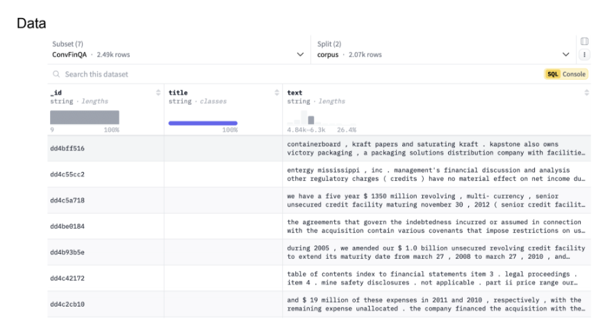
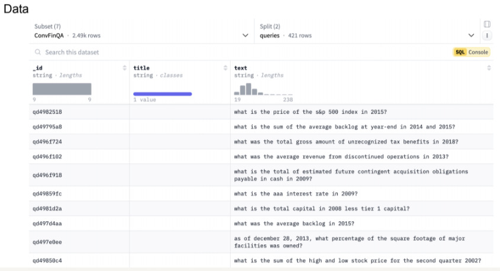
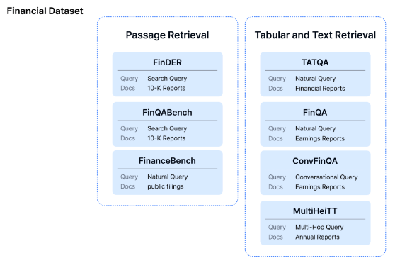

## Data Description

각 팀에 제공되는 데이터는 다음과 같습니다. 
1. ```Corpus.jsonl```
    * ```JSONLine``` 형식, 각 줄이 하나의 **문서**를 나타냄
    * 이 파일의 Column Index(Key):
        * __id : 문서 ID
        * title : 문서 제목 (Optional)
        * text : 문서 내용
    * data/corpus 경로에 저장되어 있음

    

2. ```Queries.jsonl```
    * ```JSONLine``` 형식, 각 줄이 하나의 **질문**을 나타냄
    * 이 파일의 Column Index(Key)
        * __id : 질문 ID
        * title : 질문 제목 (Optional)
        * text : 질문 내용
    * data/queries 경로에 저장되어 있음

    

3. **Corpus-Queries Pair Data** 
    * ```TSV```형식(```Tab```으로 구분된 값)
    * Submission 양식과 동일하게 이루어져 있음.
    * data/pair 경로에 저장되어 있음

### About Query Data : Type of Question
본 대회에서 제작된 질문의 종류는 **문서 검색**과 **표를 포함한 자료 검색**으로, 총 두가지입니다. 


* **문서 검색** : 미국 기업의 연간 재무 및 사업 공시 자료를 문서 내에서 관련된 단락을 정확히 검색
    * **FinDER** : 재무 전문가의 실제 질문을 바탕으로 한 검색 질의
    * **FinQABench** : LLM을 통해 생성된 검색 질의
    * **FinanceBench** : 비전문가의 검색질의
* **표를 포함한 자료 검색**
    * **TATQA** : 기초적 사친연산, 비교 질문
    * **FinQA** : 복잡한 계산 질문
    * **ConvFinQA** : 표에서 특정 값의 수치를 묻는 질문
    * **MultiHiertt** : 여러 개의 표를 통해 답을 도출하는 질문

### Download Data
[HuggingFace](https://huggingface.co/datasets/Linq-AI-Research/FinanceRAG)를 방문하면 다음 두 파일을 확인할 수 있습니다. 
1.  ```Corpus.jsonl```
2. ```Queries.jsonl```

```Corpus.jsonl```와 ```Queries.jsonl```는 ```Datasets```, ```pandas```, ```Croissant```,```Polars```, 4가지 양식으로 로드 할 수 있습니다. 

1. ```Datasets```를 이용해 로드
```python
from datasets import load_dataset

ds = load_dataset("Linq-AI-Research/FinanceRAG", "ConvFinQA")
```
2. ```pandas```를 이용해 로드
```python
import pandas as pd

splits = {'corpus': 'FinDER/corpus.jsonl.gz', 'queries': 'FinDER/queries.jsonl.gz'}
df = pd.read_json("hf://datasets/Linq-AI-Research/FinanceRAG/" + splits["corpus", lines=True])
```
3. ```Croissant```를 이용해 로드
```python
from mlcroissant import Dataset

ds = Dataset(jsonld="https://huggingface.co/api/datasets/Linq-AI-Research/FinanceRAG/croissant")
records = ds.records("ConvFinQA")
```
4. ```Polars```를 이용해 로드
```python
import polars as pl

splits = {'corpus': 'FinDER/corpus.jsonl.gz', 'queries': 'FinDER/queries.jsonl.gz'}
df = pl.read_ndjson('hf://datasets/Linq-AI-Research/FinanceRAG/' + splits['corpus'])
```
**Corpus-Queries Pair Data** 는 [Kaggle](https://www.kaggle.com/competitions/4-ai-and-datascience-competition/data?select=FinDER_qrels.tsv)을 방문하면 확인할 수 있습니다. 아래는 ```TSV``` 파일을 로드하고 모델을 평가하는 Python 코드 예제입니다.
```python
import pandas as pd
from financerag.tasks import FinDER

# FinDER 작업 초기화
finder_task = FinDER()

# 답변 레이블의 30%가 포함된 TSV 파일 로드
df = pd.read_csv('.files/FinDER_qrels.tsv', sep='\t')

# TSV 데이터를 평가를 위한 사전 형식으로 변환
qrels_dict = df.groupby('query_id').apply(lambda x: dict(zip(x['corpus_id'], x['score']))).to_dict()

# 검색 또는 재정렬 결과가 `results` 변수에 저장된 경우
# Recall, Precision, MAP, nDCG와 같은 다양한 지표로 모델 평가
finder_task.evaluate(qrels_dict, results, [1, 5, 10])

# 평가 결과를 출력합니다 (즉, `Recall`, `Precision`, `MAP`, `nDCG`)

```
**Corpus-Queries Pair Data**를 다운받기 위해 아래의 코드를 Terminal에 입력하면 됩니다.
```
kaggle competitions download -c 4-ai-and-datascience-competition
```