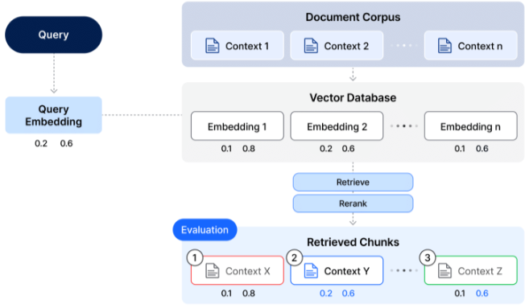

# 제 4회 KAIST-UNIST-POSTECH 데이터사이언스 경진대회
본 대회는 RAG(Retrieval-Augmented Generation)을 통해 방대한 양의 재무 문석을 효율적으로 분석하는 것을 목표로 하고 있습니다. 예선은 Retrieval, 본선은 Generation와 Service Idea를 평가합니다. 
## 예선 : Retrieval
### Goal
다양한 방식으로 제작된 질문을 바탕으로 주어진 자료에서 알맞은 단락을 파악하는 검색 능력을 평가합니다. 




### Submission
Test Set에 있는 모든 ```Query_id```에 대해, ```Corpus.jsonl```에 있는 단락 중 가장 관련이 높은 상위 10개의 ```corpus_id```값을 높은 순위의 단락부터 순차적으로 저장해 제출해야 합니다. 제출 파일은 헤더를 포함한 ```csv```파일이여야 하며, 다음과 같은 형식을 만족해야합니다:

```python
query_id,corpus_id
qd496c6a0,dd4b92b32
qd496c6a0,dd4ba2a5a
qd496c6a0,dd4be1f98
...
qd496c9c0,dd4b9f292
qd496c9c0,dd4c5d6ca
qd496c9c0,dd4b9ec5c
etc...
```

제출 시 주의해야할 점들은 다음과 같습니다:
* 하루에 Kaggle LeaderBoard에 올릴 수 있는 횟수는 **5번**입니다. 초과 제출시 Public LeaderBoard에 반영되지 않으며, 최종 평가시 **마지막 제출 결과만 반영됩니다**. Private Leaderboard 제출은 대회 기간동안 총 5회로 제한됩니다. 
* 팀의 결과가 반영되기 위해, 재현 가능한 코드를 실행 절차와 함께 제출해야합니다. 